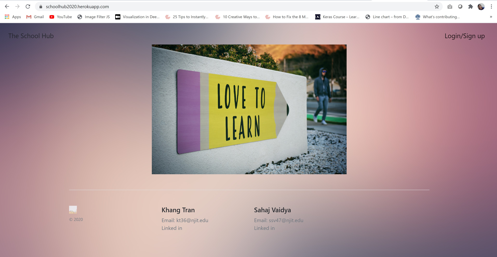
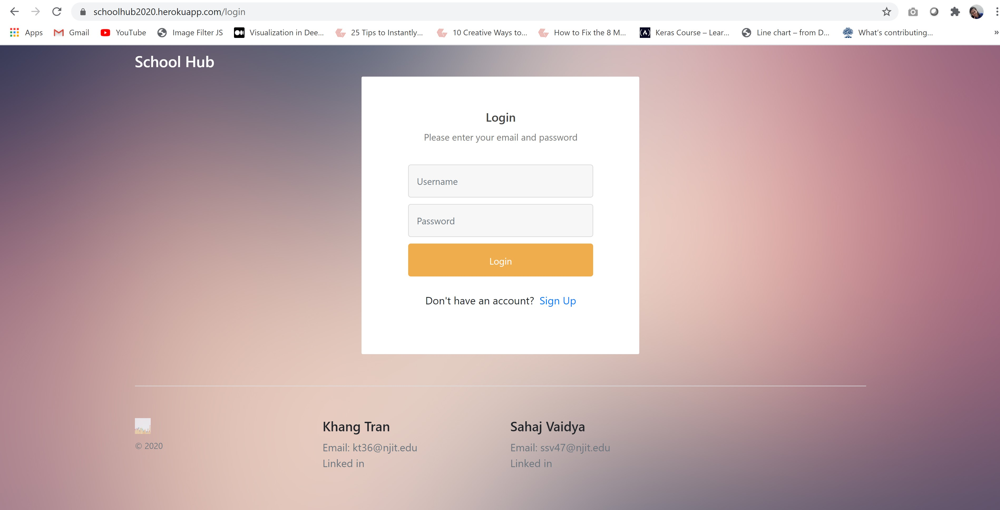
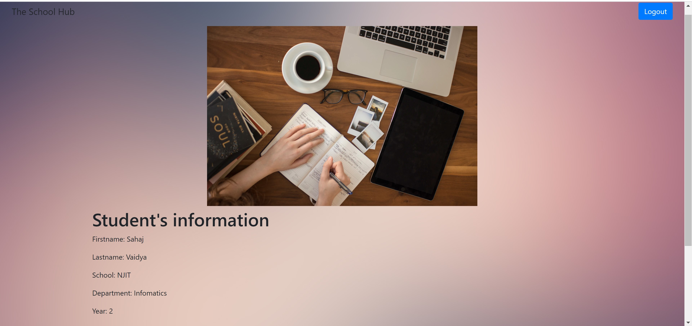

# IS601- Final Team Assignment

## Authors
1) Khang Tran
2) Sahaj Vaidya 

##Link to Application : https://schoolhub2020.herokuapp.com/
##Screenshots from the application:
1) Home Page:

2) Login Page

3) Profile Page

## Feature description of the application:

Registration - Using the sign up form, any new user can enter the required details
and register themselves into the application. Before a new user is activated,
a verification email is sent to the new user to check and verify their identity.

Login - The Login page prompts the user to enter the credentials thereby authenticating 
 the user before signing them into the system.
 
Student Profile - This page displays the details of users including their name, school,
program and year of joining the school.

## Task Allocation:

Khang Tran - Worked on the Python code to setup the login system.

Sahaj Vaidya - Worked on the Boostrap function to organize the layout of the application.

## Installation Instructions:

This project is put on the github repository in this [link](https://github.com/khangtran2020/IS601-finals). To run the project, please follow the steps below:
* Step 1: Open your terminal and clone the repository - make sure that your machine already has git installed. Clone the repo by command: `git  clone https://github.com/khangtran2020/IS601-finals`
* Step 2: Go to the project directory by `cd IS601-finals` and run the docker-compose file to start the project and try it out with command: `docker-compose up`.

The `docker-compose.yml` file will sure put everything up and run correctly. Have fun.

